# LaSalle - Diseño del software II 🎓🏭

# PokeApi 🎮 


# Content 📇

* 1. Challenge 1 - Pokemons 
* 2. Challenge 2 - Pokemon Favorites
* 3. Challenge 3 - Pokemon Details
* 4. Individual Challenge  - Publish / Subscriber - RabbitMQ
* 3. Folder structuring
* 4. Install 
* 5. Results


# 1. Challenge - Pokemons 1️⃣🤔💭

### Requirements:

* API: https://pokeapi.co
* Given the name of the pokemon return the type by:
  * Console - Terminal
  * Via Endpoint Http Body Json
* Control exceptions (Pokemon not found, PokeApi is down).
* The input via argument has to continue to work even if the api is down.

### Design:

* Commits bounded
* One class per file
* Create the classes strictly necessary to avoid duplicating the logic of the use case.

# 2. Challenge 2️⃣ - Pokemon Favorites 👤❤️ 

### Requirements:

Enable management of a user's favorite pokemon via HTTP endpoint, use cases:

* Create new User (saving on local memory).
* Add pokemons to User. 
* Unit testing

Conditions:

* We assume that the user is authenticated and we receive his user_id in the header.
* A user cannot have the same pokemon as favorite more than once.
* We assume that the pokemon ID exists.

### Design:

* We generate a new **Bounded Content User**, to encapsulate funcionality in a single domain model.

Use cases:

* **AddPokemonToUserFavorite:** Requires UserId and PokemonName, verify that user exist to add the pokemon to favorite.
* **Create User:** Creates a new User from UserId (ValueObject) on local memory if not exist.
* **GetPokemonUserFavorite:** From a UserId return the list of favorite pokemons if exist.


# 3. Challenge 3️⃣ - Pokemon Details 👌

### Requirements:

We want to obtain the details of a pokemon based on an ID via HTTP endpoint:
JSON Response:
* ID
* Name
* Types (only names)

**Acceptance test** and **Integration test**.

Conditions:

* Catch and drive when pokemon not exist
* Catch and drive when the external API is offline.


### Design:

* We generate a new **Module** inside the previous **Pokedex Bounded Content**, to encapsulate similar funcionality.

Current global project structure:

* Pokedex (BC)
  *  **Pokemons** (Module)
  *  **Types** (Module)
* Users (BC)
  *  **Users**  (Module)


# 4. Individual Challenge - Publish / Subscriber - RabbitMQ

### Requirements:

We want to return the number of times a pokemon has been marked as favourite.

* Return via endpoint/http count of mark as favourite inside a JSON.
* Add new test related with new implementation.


### Design:

We have to use a message broker **RabbitMQ** to apply the pattern Publisher/Subcriber betwen the User (when add favorite pokemon) and Pokemon (to increase the counter of markedAs).


# 3. Folder Structure 📂

* **Boundend context**: Objective to divide and isolate domain models.
  * **Module**: Concepts within a bounded context.
    * **Infraestructura Layer**
    * **Application Layer**
    * **Domain Layer**
      *  **Aggregator**: Group of domain objects (entities and VOs) that can be treated as a single unit.
      *  **Entities**: Unique identity Mutable .
      *  **Domain Services**: Encapsulate application behaviors not belonging to any entity. Input and output of domain objects.
      *  **Value Objects**: Objects of our application.

  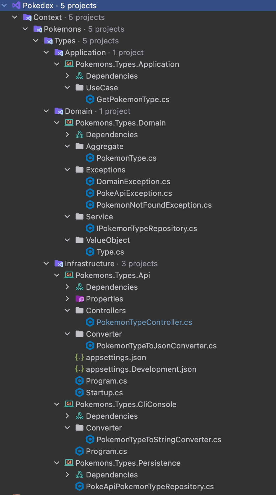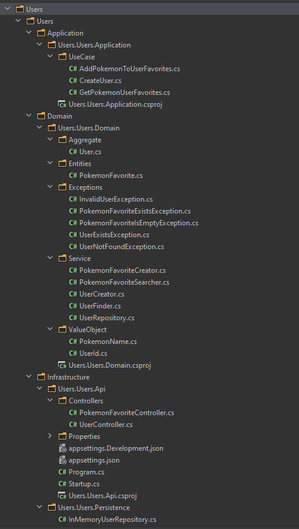


**DDD Layers:**  

<p align="center">
 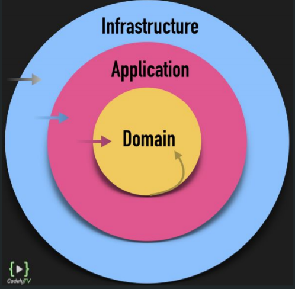
</p>

# 3. Install 🔧 

* Dotnet is required to build and run the app, you can downloand from official page (we recommend 5.0):
https://dotnet.microsoft.com/download/dotnet/5.0

---

## Console - CLI 🖥️
```git clone https://github.com/CarLoOSX/mdas-api-g3```
### Execute the following commands
```
cd mdas-api-g3
cd src/main/Pokedex/Context/Pokemons/Types/Infrastructure/Pokemons.Types.CliConsole/
```
### Compile the app
```dotnet build Pokemons.Types.CliConsole.csproj```
### Run the app and pass the pokemon as argument
```dotnet run charizard```

---

## Api Rest 🌐

## Pokemons API 1️⃣
### Execute the following commands
```
cd mdas-api-g3
cd src/main/Pokedex/Context/Pokemons/Types/Infrastructure/Pokemons.Types.Api
```
### Compile the app
```dotnet build Pokemons.Types.Api.csproj```
### Run the app
```dotnet run Pokemons.Types.Api.csproj --urls="http://localhost:5001"```
### Go to
```http://localhost:5001/swagger/index.html```

---

## Users/Pokemon Favoite API 👤2️⃣
### Execute the following commands
```
cd mdas-api-g3
cd src/main/Pokedex/Context/Users/Users/Infrastructure/Users.Users.Api
```
### Compile the app
```dotnet build Users.Users.Api.csproj```
### Run the app
```dotnet run Users.Users.Api.csproj --urls="http://localhost:5002"```
### Go to
```http://localhost:5002/swagger/index.html```

---

---

## Unit Test - Users/Pokemon Favorite API ✅
### Execute the following commands
```
cd mdas-api-g3
```
### Execute test the app
```dotnet test  test/main/Pokedex-test```

**Note:**

* **Unitary testing:** *.Application.Test y *.Domain.Test


---

---

## Pokemons Details API 3️⃣
### Execute the following commands
```
cd mdas-api-g3
cd src/main/Pokedex/Context/Pokemons/Pokemons/Infrastructure/Pokemons.Pokemons.Api
```
### Compile the app
```dotnet build Pokemons.Pokemons.Api.csproj```
### Run the app
```dotnet run Pokemons.Pokemons.Api.csproj --urls="http://localhost:5003"```


### Go to
```http://localhost:5003/swagger/index.html```

---

---

## Integration - Acceptance test ✅
### Execute the following commands
```
cd mdas-api-g3
```
### Execute test the app
```dotnet test  test/main/Pokedex-test```

**Note:**
* **Acceptance test:** *.Apit.Test
* **Integration test:** *.Persistence.Test

---


# 4. Results 📷

## Pokemons Results - Challenge 1
## Charizard example 🔥:
## Console 🖥️
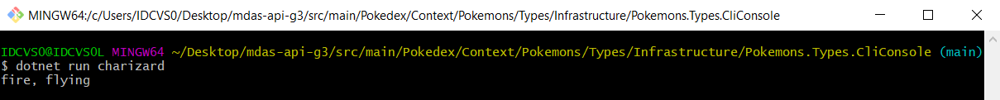

## Swagger - Api Rest 🌐
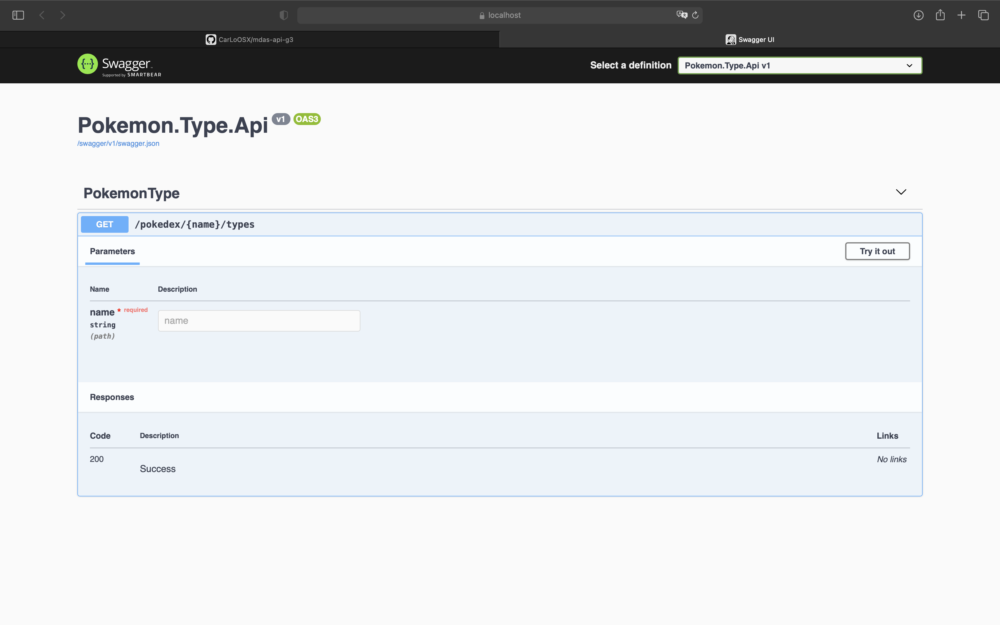

---

## Pokemon Favorites Results  - Challenge 2

## Unit Test - Users/Pokemon Favorite API ✅

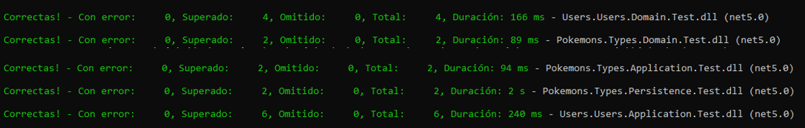

## Swagger User - Api Rest 🌐
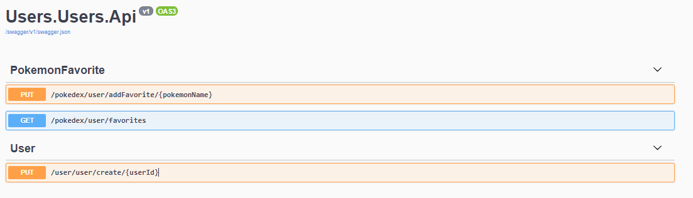

## Create User example 👤:

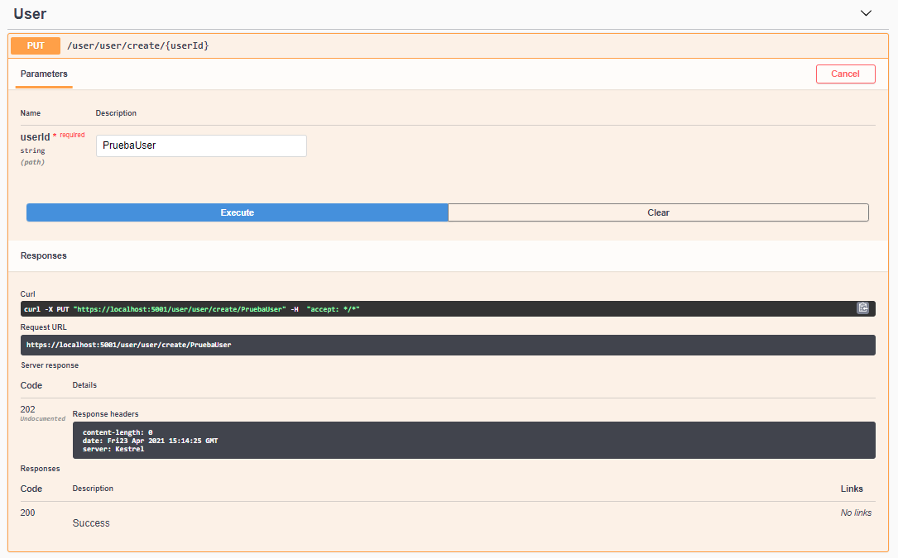

## Add favorite example ❤️:

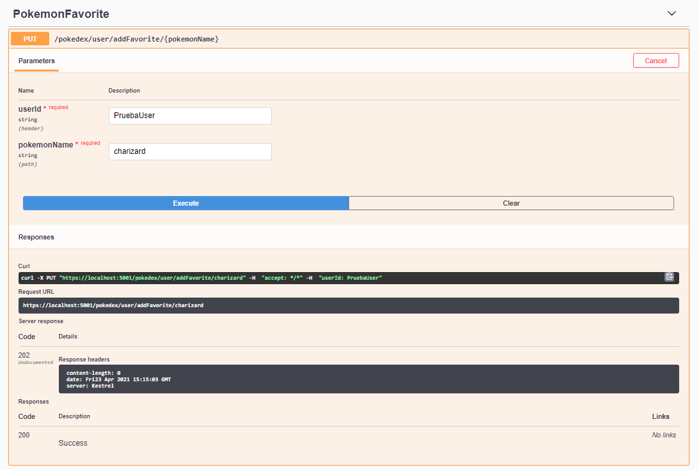

## Get all favorites from user 🔍:

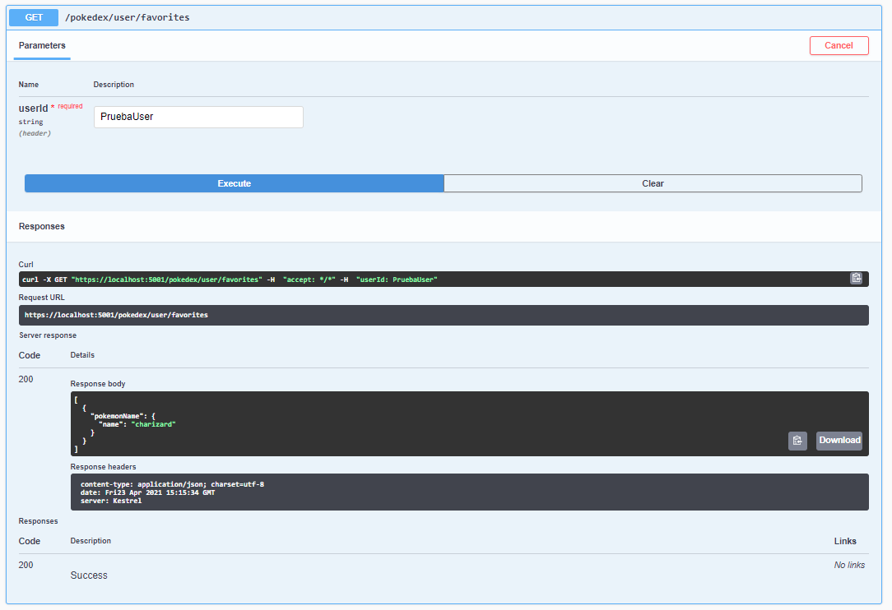


## Pokemons Details  - Challenge 3

## Swagger Pokemons - Api Rest 🌐
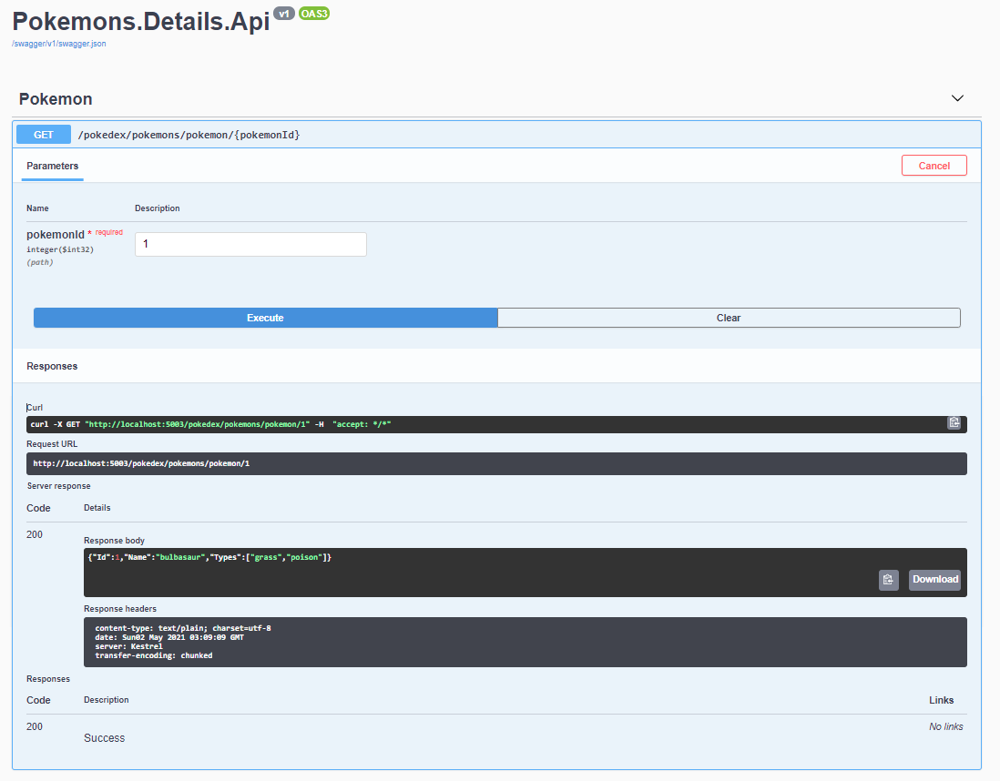

## Acceptance  - Integration  - Unitary Testing ✅
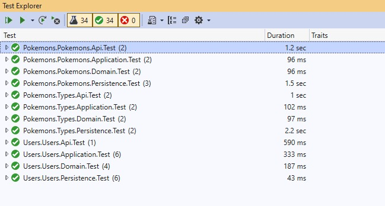

**Note:**
* **Acceptance test:** *.Api.Test
* **Integration test:** *.Persistence.Test
* **Unitary testing:** *.Application.Test y *.Domain.Test
